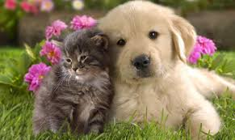
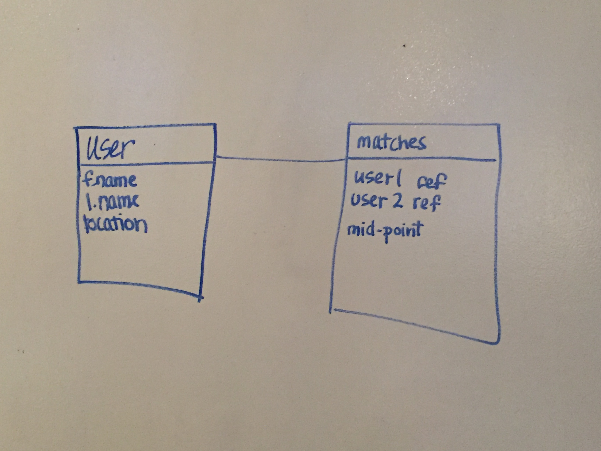
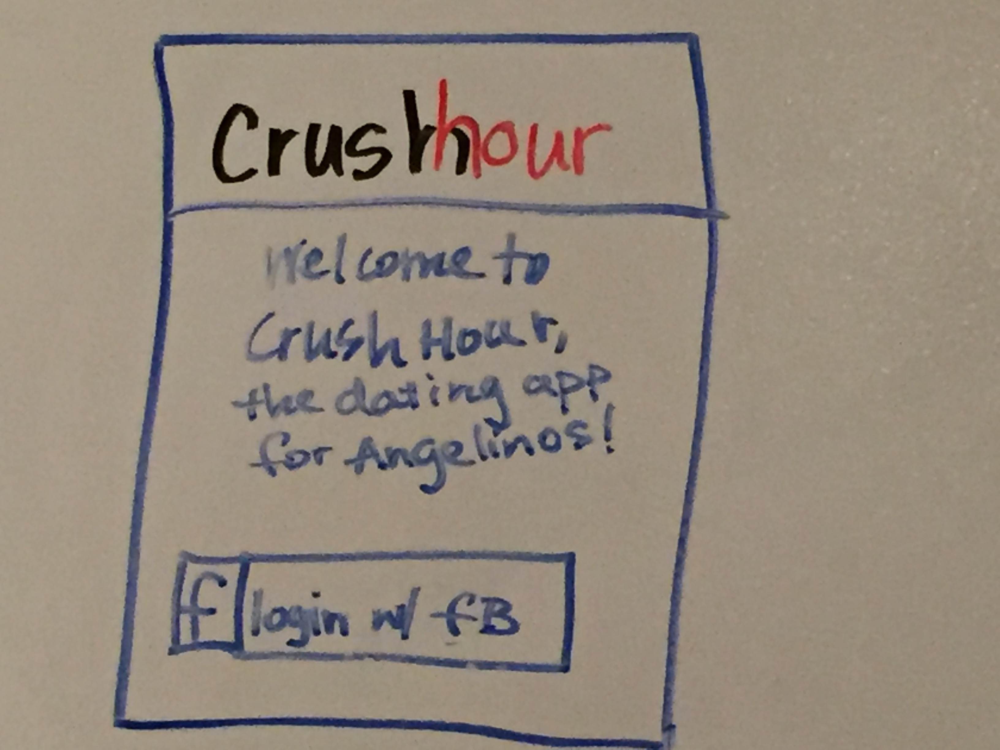
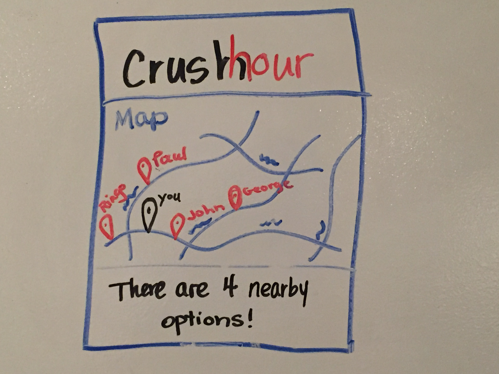
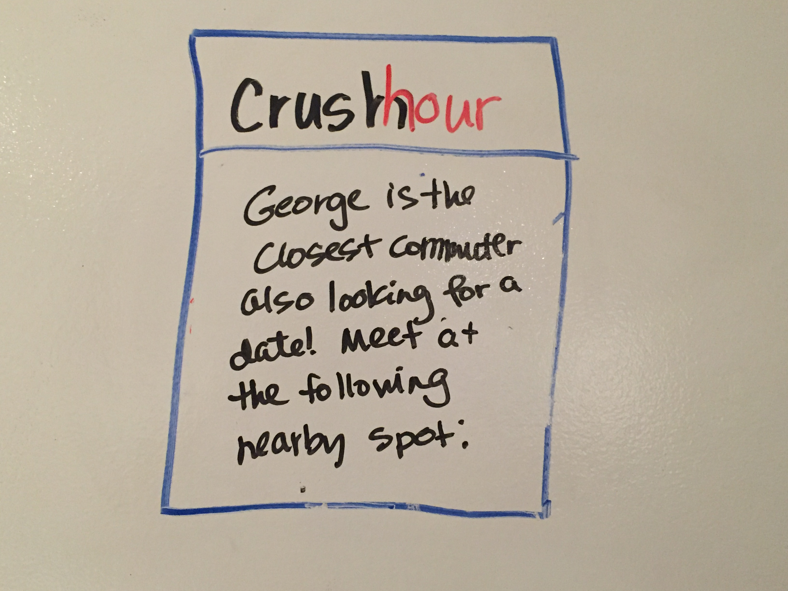
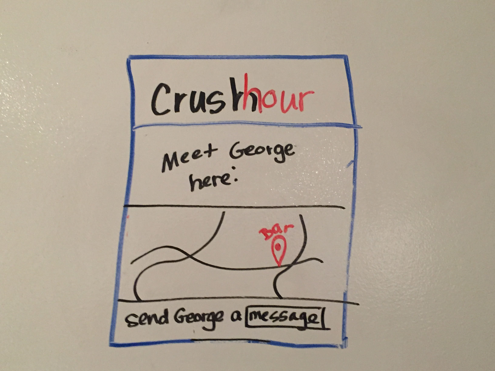

# project4 - CRUSH HOUR

###Description
Have you ever been sitting in traffic on Wilshire Blvd. and wished you were having fun instead? Have you ever wondered if others around you, sitting isolated in their own cars, were feeling the same way? Welcome to Crush Hour, the dating app for Angelinos. With Crush Hour, you can say goodbye to the Traffic Jam blues by locating someone near you who also wants to escape the tedium of rush hour! You will be matched with someone for a spur of the moment date: what a great alternative when you're not going anywhere anyway.

These puppies met on their commute using Crush Hour.

###Technologies
Crush Hour will be built in the MEAN stack and made responsive by use of Bootstrap, so that it can be used in the cell phone browser. Users will sign in through facebook and Crush Hour will use the public Google Maps Geolocation API to determine users' locations and match them with others nearby. 

- HTML5
- CSS
- JavaScript
- MongoDB
- Express
- Angular
- Node.js
- Google Maps Geolocation API
- Bootstrap
- Mongoose
- OAuth

###Trello
https://trello.com/b/XVbTzpGE/project4-crush-hour

###ERD

###Wireframes

